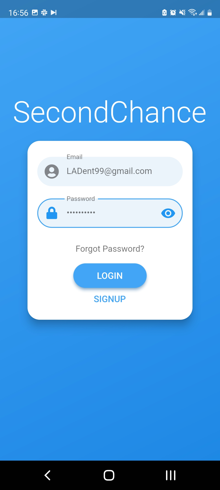
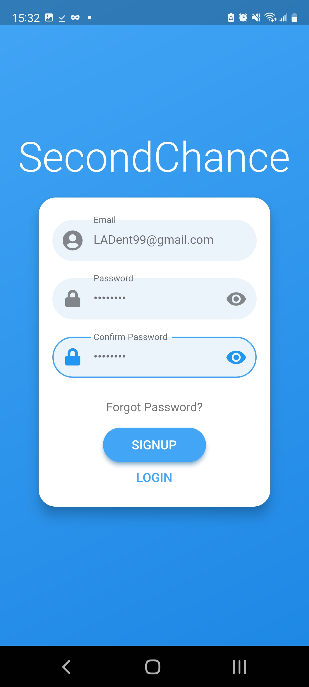
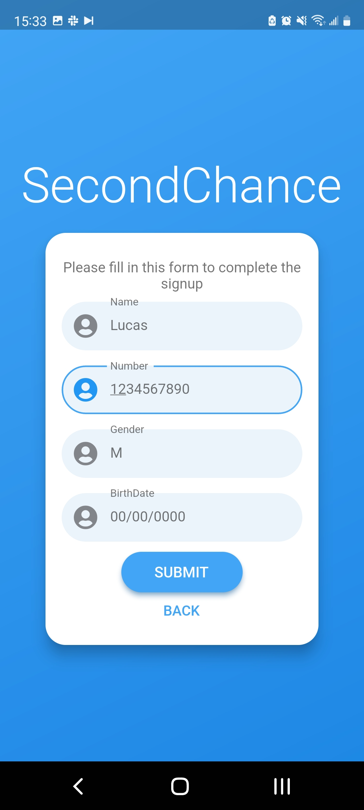

## Welcome to SecondChance

### Table of Contents
* [User Manual](#manual)
   * [Account Creation](#account_creation)
   * [App Navigation](#app_navigation)
   * [Editing your Profile](#editting_profile)
   * [Matching](#matching)
* [Support](#support)

### User Manual 

#### Account Creation / Login 
1. Put in your email for your username. Note: only 1 account per email is allowed in the system
2. Create your password.  8 charaters minimum, 1 number, 1 uppercase, 1 lowercase, and 1 symbol minimum   
   
3. If creating a new account, click **Sign Up** and verify your password.  If logging in, press login and you are finished!   
   
4. Continue to input the information requested   
   
5. You will recieve a verification email in your inbox, input the code to complete signup!     
   **TODO: PICTURES FOR INPUT CODE/EMAIL**

#### App Navigation 

#### Editing your Profile 

#### Matching 

### Support and Bug Reporting 

Having issues with the App?  Check out our [current issues](https://github.com/OSS-Second-Chance/SecondChance_Org/issues) to look for a possible solution or to report the bug!

